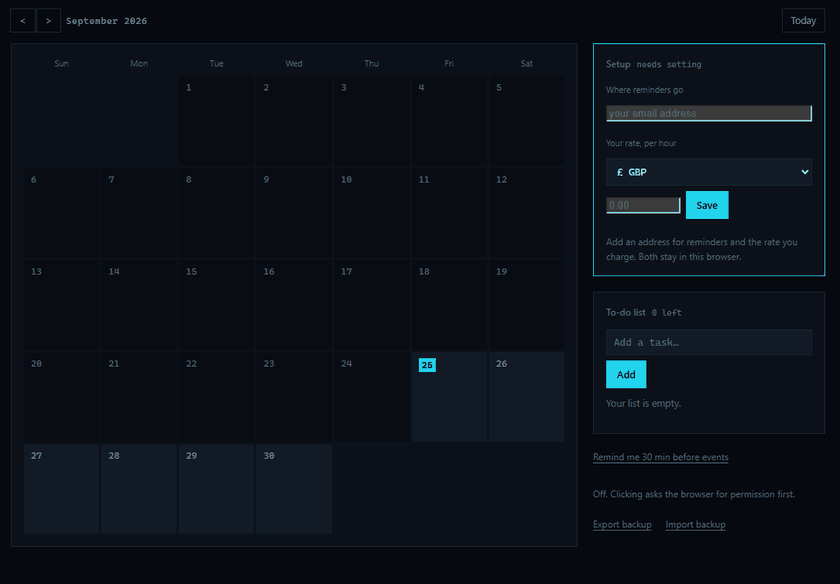
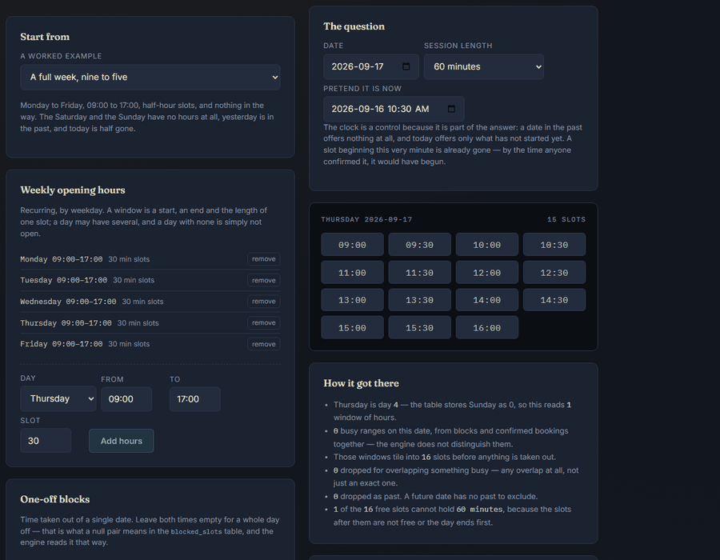

# Almanac — Multi-Role Appointment Booking Platform

[](https://github.com/luke-zhang-cs-py/Almanac-Main-Full-Stack-Calendar/actions/workflows/python-package.yml)
[](LICENSE)
[](https://www.python.org/)

Your own calendar, and the booking platform behind it: clients book a
provider's free slots, and providers can email someone an invite that turns
into a booking without the guest ever making an account.

### ▶ [Start a blank calendar →](https://luke-zhang-cs-py.github.io/Almanac-Main-Full-Stack-Calendar/calendar.html)



*Blank, then yours. One self-contained HTML file you double-click — no server,
no assets, nothing leaving the browser. The entries above were typed into the
page while the frames were captured.*

It ships two ways. [`calendar.html`](docs/calendar.html) has **nothing** in it
— no term, no diary, no fixtures, no to-dos, no countdown. `planner.html` is
the same engine seeded with an invented term, which shows what it does and is
the wrong place to start a real one from: you would be deleting somebody
else's lectures first. Build your own with
`python tools/build_planner.py --data …`, and keep the seed outside the repo
— a term timetable says where somebody is at every hour of every weekday, so
`.gitignore` blocks the real one and `tests/test_planner.py` fails if one
appears beside the sample.

## Then the booking half

### ▶ [Try the slot engine →](https://luke-zhang-cs-py.github.io/Almanac-Main-Full-Stack-Calendar/app/)



*Set weekly hours, add a block or a booking, pick a date — and the board
recomputes in the tab. Each example shows the engine's own arithmetic: how many
windows it read, how many slots it tiled, how many it dropped and why.*

That page is **the slot engine only, not the platform** — JWT auth, a
relational database, transactional email and a background reminder thread
genuinely can't run in a browser tab, so none of them are mimed. `js/slots.js`
is a port of `domain/calendar_logic.py`, and `tools/build_static.py` runs the
two against each other in a real browser over 21 scenarios before publishing,
refusing to write a single file if they disagree about one slot.

**[Read the full write-up →](https://luke-zhang-cs-py.github.io/Almanac-Main-Full-Stack-Calendar/)**
— what a free slot has to survive, how five kinds of email get sent exactly
once, and every bug this has had. There's also an
[architecture map](docs/architecture.html).

## Run it locally

```bash
pip install -r requirements.txt
python -m scripts.seed_data   # creates admin@almanac.local / admin12345
python app.py              # http://127.0.0.1:5003
```

No `.env` needed to start — SQLite and a dev JWT secret by default. It binds
`127.0.0.1`; set `HOST=0.0.0.0` only when you mean it. Running with
`FLASK_DEBUG=0` and no real `SECRET_KEY` is refused outright, because the dev
secret is committed and therefore public, and it signs every session token.

Switching to managed Postgres (Supabase, Neon, Render, RDS) is one environment
variable, `DATABASE_URL`. No code changes.

## Project layout

The root holds the things you *run*; everything you *import* lives in a package
named for its layer. The arrows only point one way —
`core` ← `accounts`/`domain` ← `notify` ← `routes` ← `app.py` — so an import
pointing back up is a cycle and says so immediately.

```
app.py            Flask app factory, blueprint registration
core/             config.py, database.py          settings; SQLite or Postgres
accounts/         auth.py                         JWT creation, RBAC decorators
domain/           calendar_logic.py               the free-slot engine
                  coffee_chats.py, offerings.py,
                  pounds.py, schedule.py          the rules: no HTTP, no email
notify/           mailer.py, notifications.py,    transport, occasions, layout,
                  coffee_notifications.py,        and the one background timer
                  email_render.py, scheduler.py
routes/           nine blueprints, one per area of the API
scripts/          seed_data.py, seed_luke.py,     things you run by hand;
                  login_page.py                   nothing imports them
docs/app/         the slot engine, ported to JS and published on its own
tools/            build_static.py, build_planner.py, refresh_figures.py
```

`app.py` stays at the root because `Flask(__name__)` resolves `templates/` and
`static/` relative to its own directory. The three in `scripts/` are run as
modules — `python -m scripts.seed_data` — because a file run directly puts
*its own* directory on `sys.path`, and `scripts/` is not what they import
from.

## How the two halves meet

```bash
python tools/build_planner.py --blank --out calendar.html
```

**Where the full-stack half comes in.** A `file://` page can show a
notification while its tab is open and nothing at all once it's closed — it
can't register a service worker, so there's no background to run in. That's
the gap Almanac closes: export a backup from the calendar, import it, and the
server's sweep emails you before each event whether or not anything is open.
`domain/schedule.py` owns that, keyed on the planner's own event ids so
re-importing updates rather than duplicates. A lecture is deliberately *not*
an appointment — no second party, no provider to notify, no slot to hold — so
it lives in its own table with no booking semantics.

## The parts worth knowing

**A free slot has to survive a lot.** `domain/calendar_logic.py` turns
recurring weekly hours, one-off blocks and existing bookings into bookable
times — dropping anything that overlaps something busy *at all* (not just an
exact match), anything already past on today's date, and anything too short for
the requested session. A partial-unique index makes race-condition
double-booking impossible at the database level rather than in application code.

**Five kinds of email, each sent exactly once.** Welcome, confirmation,
cancellation, completion and a 24-hour reminder, all without anyone pressing a
button. Delivery runs on a background thread so a slow mail server never slows
a booking; every attempt is recorded in an `email_log`; and a unique index over
that log is what guarantees nobody is mailed the same thing twice — the
guarantee lives in the schema, not in a code path that could be missed.

**Coffee chats run the other way.** An email that *produces* a booking: send an
invite, they click, they see real availability, they pick a time — **with no
account**. A coffee chat is usually first contact, and asking an alum to
register before picking a slot loses most of them. Follow-ups go out after
three days, capped at two, because a third is pestering.

**Money is an integer in minor units,** and `0` means free — a real answer, not
a missing one.

## Tests

```bash
pytest -q
```

506 tests, 100% of 1,952 statements. 14 of those guard the published slot-engine
demo: every copied file byte-identical to its source, no `fetch()` anywhere so
`file://` keeps working, and every clause of the "this is not the platform"
banner still present.

The build's own check is the other half, and it's the one that can't run in CI:
it needs a real browser. `python tools/build_static.py --prove` sabotages the
published port twelve ways — shifting every weekday by one, treating a
whole-day block as zero length, dropping the `provider_id` filter — and
requires each to be caught.

## License

[MIT](LICENSE) — see [CONTRIBUTING.md](CONTRIBUTING.md) for setup and conventions.
